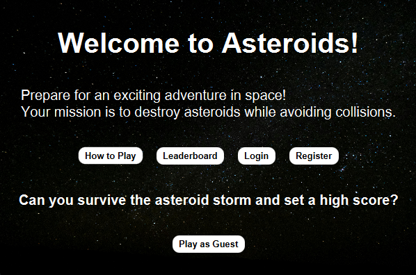
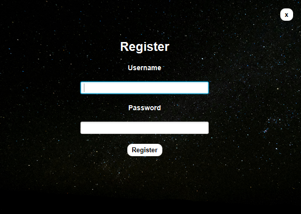
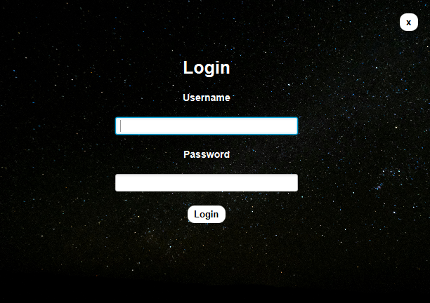
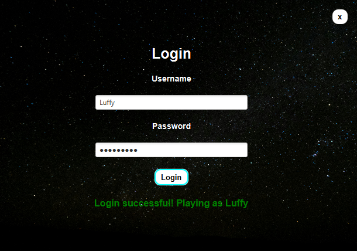
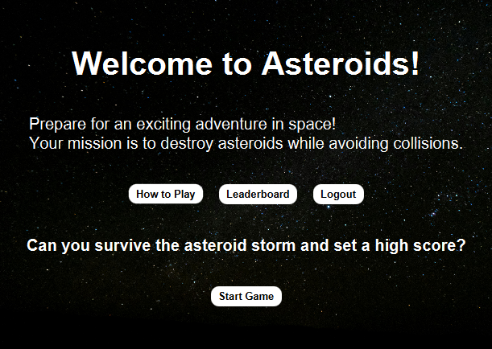
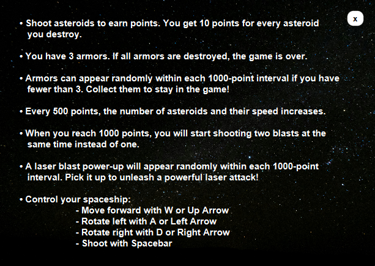
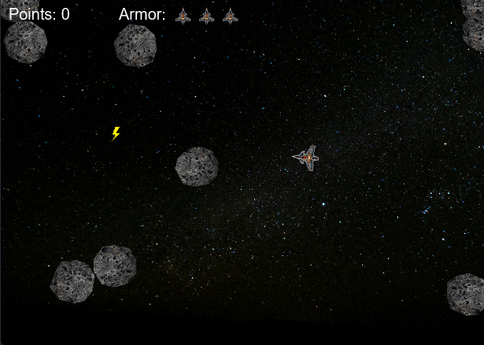

# Asteroids
A classic Asteroids-inspired game built with JavaFX. The game involves controlling a spaceship that must avoid and destroy asteroids while collecting power-ups. The goal is to survive as long as possible while dodging incoming asteroids.

## Features
- Classic Asteroids gameplay with rotating and moving spaceship.
- Asteroids that move across the screen and spawn randomly.
- Lives are represented as "armors" that can be lost when colliding with asteroids.
- Armors can be picked up when they spawn, providing extra protection.
- Power-up in the form of a huge laser blast that destroys asteroids.
- Scoring system to track progress.
- Sound effects to enhance the gaming experience.

## Installation
Download the "Asteroids_Setup.exe" file from the [Releases](https://github.com/MateoAgolli/asteroids-game/releases) section, run it and then follow the installation instructions.

## How to play
```
• Shoot asteroids to earn points. You get 10 points for every asteroid you destroy.  
• You have 3 armors. If all armors are destroyed, the game is over.  
• Armors can appear randomly within each 1000-point interval if you have fewer than 3. Collect them to stay in the game!  
• Every 500 points, the number of asteroids and their speed increases.  
• When you reach 1000 points, you will start shooting two blasts at the same time instead of one.  
• A laser blast power-up will appear randomly within each 1000-point interval. Pick it up to unleash a powerful laser attack!  
• Control your spaceship:  
                                          - Move forward with W or Up Arrow  
                                          - Rotate left with A or Left Arrow  
                                          - Rotate right with D or Right Arrow  
                                          - Shoot with Spacebar  
```

## Screenshots







